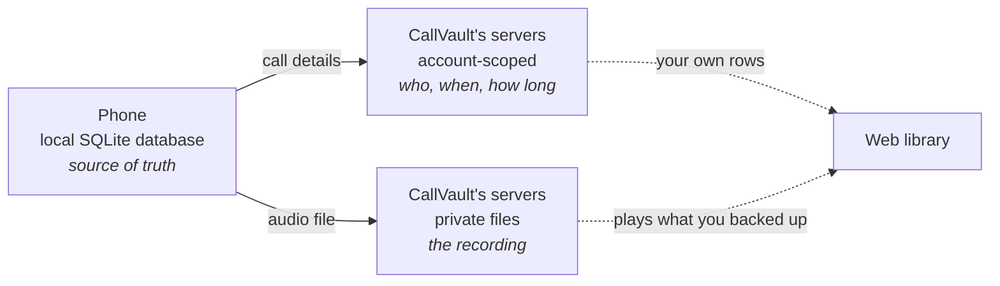

# Data layer

CallVault keeps your recordings in two places at most, and the second one is optional.

## On the phone, the source of truth

The phone holds a local SQLite database, and it is the authoritative copy. A recording is created there, a note or a favorite is written there first, and the whole library keeps working with no network connection at all. It holds each call's details: the number, the direction, when it started, how long it ran, which SIM handled it, the audio format and the file size, plus your notes and favorites, and a small settings store for things like appearance, language and the Wi-Fi-only upload preference. A contact name is stored too when an imported recording carried one; CallVault never reads your address book.

Guests never go past this point. Up to 100 recordings stay on the phone without an account, and at 100 new recording pauses while everything already there keeps playing, searching and exporting. Signing in with Google removes the count limit.

## The call details, once backup is on

Each recording's details are mirrored to CallVault's servers and scoped to your account. There is no audio there. It is only the facts about a call, which are sensitive on their own, so they are account-scoped exactly as the audio is.

## The audio, once backup is on

The audio files go to CallVault's servers as private files only you and a CallVault administrator can reach. There are no public links to any of them. CallVault checks each file against the [100 MB per-file cap](/user-guide/sync-backup#the-100-mb-per-file-cap) before uploading, and deletes the stored file when you delete the recording everywhere. Your cloud usage is summed from what is actually stored, so the space comes back on the next read.

## Why the split

Keeping the audio apart from the call details lets the web library work from the cloud copy alone, while the phone keeps the authoritative offline one. See [the sync pipeline](/architecture/pipeline) for how a recording moves between them.

## Complete the next step

Read [Private cloud backup](/user-guide/sync-backup) for what your plan limits, or [Security and privacy](/architecture/security-privacy) for who can reach what.
