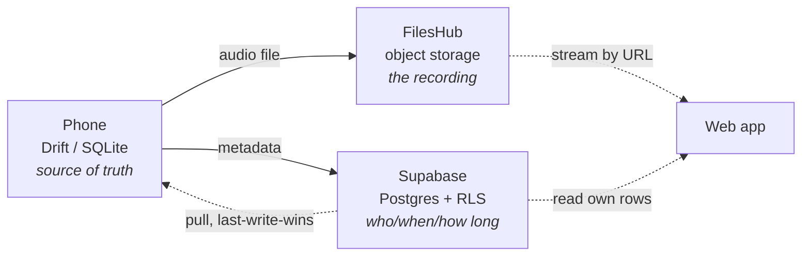

# Data layer

CallVault stores three things in three places, each with a clear job.

## On device — the source of truth

The phone holds a local **SQLite database (Drift)**. This is authoritative: recordings are
created here, edits (favorite, note) happen here first, and nothing is deleted here before
it's confirmed backed up. It holds each recording's details — number, direction, contact,
SIM slot, timestamps, duration, size, format, its pipeline status, and your note/favorite —
plus a small key-value store for settings like theme, language, Wi-Fi-only, and retention.

## Metadata — Supabase

When you're signed in, each recording's **metadata** is mirrored to a Postgres table in
**Supabase**, scoped to your account by row-level security. There is no audio here — only
the facts about a call (who, when, how long, your note). That metadata is itself sensitive,
so the rules keep every row strictly owner-scoped (with admin reach granted separately —
see [Roles & access](/admin-guide/roles)).

## Audio — FilesHub

The **audio files** go to **FilesHub** object storage. CallVault checks each file against
the [100 MB cap](/user-guide/sync-backup#the-100-mb-per-file-cap) before uploading, verifies
the size after, and deletes an object idempotently when you delete the recording. The web
app plays audio by streaming it from the object's URL rather than downloading a local copy.

## Why three stores

Splitting audio from metadata keeps each store doing what it's best at, keeps the sensitive
"who/when" data under strict database rules, and lets the web app work purely from the cloud
copies while the phone keeps the authoritative offline copy. See the
[sync pipeline](/architecture/pipeline) for how a recording flows between them.
