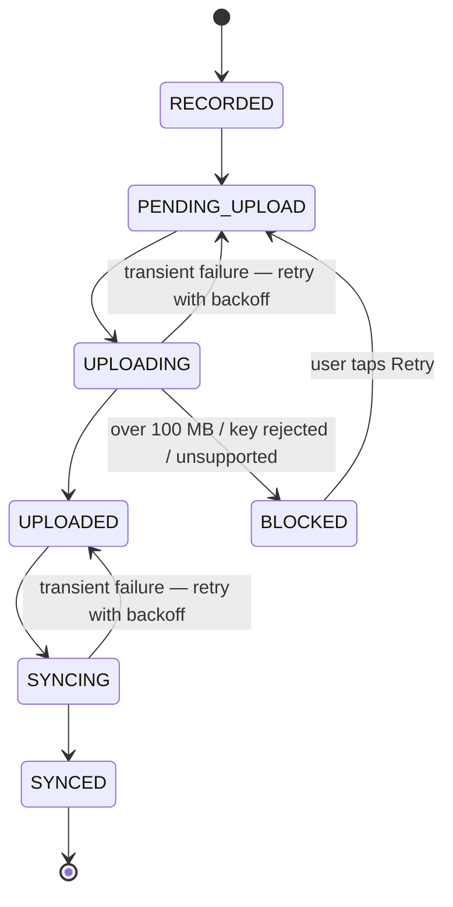

# The sync pipeline

CallVault is offline-first: a recording is usable the instant it's captured, and backup
happens afterwards in the background. Each recording moves through an explicit state
machine so its progress — and any problem — is always visible.

## The states

- **RECORDED → PENDING_UPLOAD** — the file exists locally and is queued for backup.
- **UPLOADING → UPLOADED** — the audio is sent to FilesHub.
- **SYNCING → SYNCED** — the metadata is mirrored to Supabase. Done.

## Retry and backoff

A transient failure (a dropped connection, a temporary server hiccup) doesn't lose the
recording — it goes back a step and is retried on an increasing delay, with separate
counters for the upload leg and the sync leg. A flaky connection resolves itself without
you doing anything.

## The blocked state

Some failures aren't worth retrying forever — a file over the
[100 MB cap](/user-guide/sync-backup#the-100-mb-per-file-cap), a rejected key, an
unsupported type. Those move to a terminal **blocked** state with a reason attached, leave
the retry queue, and surface in the [Sync health](/user-guide/sync-backup#sync-health)
"Needs attention" card. They stay safe on the device; only the cloud copy is skipped until
you clear or retry them.

## Idempotency and safety

- Each recording carries a stable identifier, so an upload or a metadata write that happens
  twice (after a retry) is de-duplicated rather than doubled.
- Retention cleanup **never** removes a local file before it is `SYNCED` and
  checksum-verified. Your device copy is always the safety net.

The work is driven both by a background worker (periodic upload → sync → cleanup) and, for
a live UI, by a foreground coordinator that drains the queue when connectivity returns, on
new recordings, and when the app resumes.
