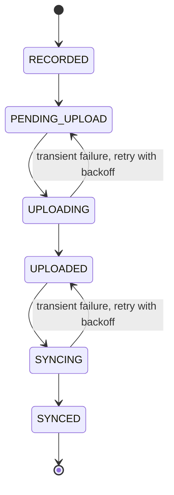

# The sync pipeline

A recording is usable the moment the call ends. Backup happens afterwards, in the background, and every step of it is visible on one screen.

## How a recording moves

Those are the six states CallVault actually stores against a recording, and they read in order. **Recorded** means the file is on the phone. **Pending upload** means it is waiting its turn. **Uploaded** means the audio has reached CallVault's servers as a private file. **Synced** means the call's details are mirrored too, and the recording is done.

None of this runs while private cloud backup is off. Uploads run on Wi-Fi by default, and a setting in the same place allows mobile data.

## Each track moves on its own

A call is often several tracks, and the pipeline treats each one separately. A track is pending upload, then uploading, then uploaded, then synced, and a track that has stopped for good is **failed**. The recording reaches Synced when every one of its tracks has, which is why a call can sit at Uploading while one track is already done.

## Retry and backoff

A dropped connection costs you nothing. Neither does a brief server problem. It goes back a step and is retried on an increasing delay, with separate counters for the upload leg and the details leg. A flaky connection usually resolves itself while you do nothing at all.

## What stops, and why

Some failures aren't worth retrying forever. The common one is size: CallVault checks a file against the [100 MB per-file cap](/user-guide/sync-backup#the-100-mb-per-file-cap) *before* it starts uploading, so an oversize recording is never sent at all. It stays on the phone with the reason attached, and it appears under **Needs attention** in [Backup & sync health](/user-guide/sync-backup#sync-health), which is a list on that screen rather than a state on the recording. Only the cloud copy is skipped; the recording itself is where it always was. Read the reason before you retry.

## What happens to the phone copy

CallVault never removes a recording from the phone before that recording is synced and its checksum verified. That rule holds whatever else you choose.

What you choose is how long the phone keeps a copy after that, under **Settings → Keep local files**:

- **Keep all recordings on this device**, which never removes anything.
- **Remove from device once synced**, the default.
- **Keep 7 days after sync**.
- **Keep 30 days after sync**.

## Where you watch it

Open **Settings → Storage & sync → Backup & sync health**, which sits beside the **Private cloud backup** switch. It shows the queue, the retries, a row for each phone you use, and the **Needs attention** list, which is where anything that stopped waits with its reason attached.

## Complete the next step

[Private cloud backup](/user-guide/sync-backup) covers turning the switch on and what your plan allows.
