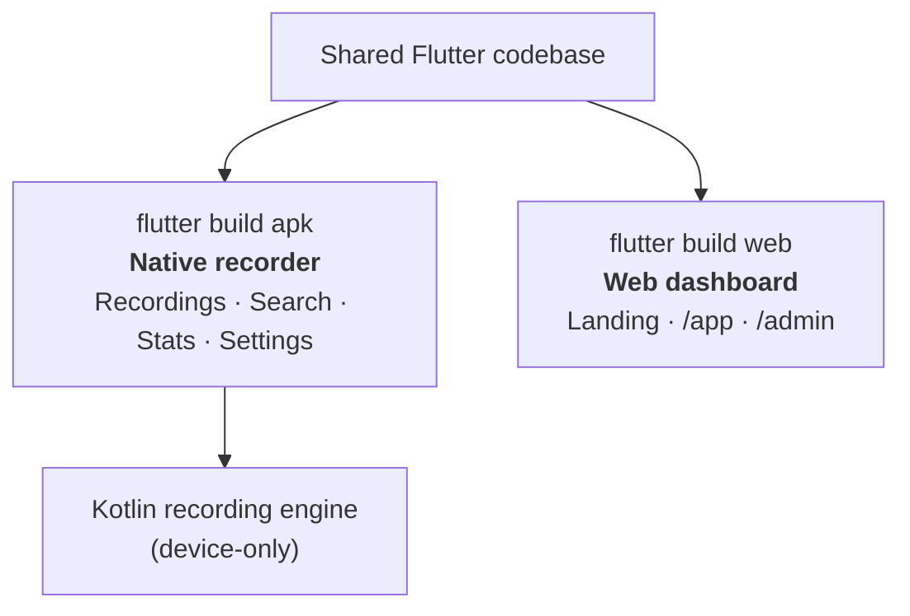

# One codebase, two builds

CallVault is a single Flutter codebase that produces two very different products:

- **`flutter build apk`** produces the native Android recorder, with a Kotlin engine for
  call capture and the full on-device experience.
- **`flutter build web`** produces the web dashboard — a public landing page, the signed-in
  [user app](/user-guide/web-app) at `/app`, and the [admin dashboard](/admin-guide/dashboard)
  at `/admin` — as a single-page app.

A conditional entry point picks the right composition root at build time, so the two builds
share the same models, screens, and data code wherever it makes sense.

## The rule that makes it work

Anything that touches the device's file system directly can only run on the phone. If such
code were reachable from the web build, the web build simply wouldn't compile. So CallVault
keeps a clean boundary:

- The device-only capture-and-file code lives in native-only modules the web build never
  imports.
- Shared screens (profile, recording detail) are written to be web-safe; the web app plays
  audio **by streaming from a URL**, never from a local file.
- The private cloud backup client has a web-safe form for the browser and a separate native
  one for the phone, which streams uploads rather than holding a whole recording in memory.

The web build is the gate: it's compiled after any change that the web side could reach, so
the boundary can't drift silently. This is why the same app can be both a real recorder and
a browser dashboard without shipping device internals to the web.
